# Demo catalog

Detailed summary of every ScripTree demo in this repo. The top table is a quick index; the section below has the longer story for each.

## Index

| Folder | Program | Upstream repository | Short description |
|--------|---------|---------------------|-------------------|
| [`feature-showcase/`](feature-showcase/) | PowerShell `Get-ChildItem` | (built into Windows) | Teaching demo — every widget and every key schema feature in one form. Start here if you're new to ScripTree. |
| [`parfit/`](parfit/) | parfit | [caldempsey/parfit](https://github.com/caldempsey/parfit) | Reflow prose inside code comments using optimal-fit line breaking. |
| [`jit/`](jit/) | jit | [cesarferreira/jit](https://github.com/cesarferreira/jit) | Jira CLI — ticket lookup, detail views, sprint lists, create/edit. |
| [`agg/`](agg/) | agg | [asciinema/agg](https://github.com/asciinema/agg) | Render asciinema `.cast` recordings into animated GIFs. |
| [`hyperfine/`](hyperfine/) | hyperfine | [sharkdp/hyperfine](https://github.com/sharkdp/hyperfine) | Statistical benchmarking for shell commands. |
| [`fd/`](fd/) | fd | [sharkdp/fd](https://github.com/sharkdp/fd) | User-friendly `find` replacement with regex/glob, smart filters, parallel walk. |
| [`dust/`](dust/) | dust | [bootandy/dust](https://github.com/bootandy/dust) | More intuitive `du` — sorted tree of largest entries with percent bars. |
| [`bat/`](bat/) | bat | [sharkdp/bat](https://github.com/sharkdp/bat) | `cat` clone with syntax highlighting, line numbers, Git, and an automatic pager. |
| [`eza/`](eza/) | eza | [eza-community/eza](https://github.com/eza-community/eza) | Modern, more-featureful `ls` with colour, icons, Git, tree view. |
| [`dog/`](dog/) | dog | [ogham/dog](https://github.com/ogham/dog) | Friendly DNS lookup CLI with UDP/TCP/TLS/HTTPS transports. |
| [`cvforge/`](cvforge/) | cvforge | [SoAp9035/cvforge](https://github.com/SoAp9035/cvforge) | YAML → ATS-friendly PDF resume via Typst. Four subcommands. |
| [`bifrost/`](bifrost/) | bifrost | [axiom0x0/bifrost](https://github.com/axiom0x0/bifrost) | Bridge files between computer and phone via QR code over LAN. |
| [`gh/`](gh/) | gh | [cli/cli](https://github.com/cli/cli) | GitHub CLI — pull requests, issues, repos, releases (eleven leaves). |
| [`awk/`](awk/) | awk | [gawk](https://www.gnu.org/software/gawk/) | Classic UNIX text-processing language. Field splitter + tiny pattern-action programs. |
| [`sed/`](sed/) | sed | [GNU sed](https://www.gnu.org/software/sed/) | Stream editor — find/replace, line deletion, regex-driven line-by-line rewriting. |

## Detailed summaries

### feature-showcase

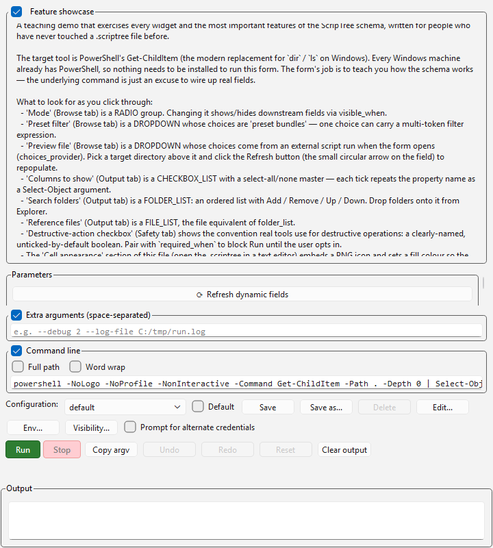

A teaching demo written for people who've never edited a `.scriptree` file. The form wraps PowerShell's `Get-ChildItem` (a built-in Windows tool — nothing to install) and exists purely as a vehicle for exercising the schema. Every widget is represented at least once, every important feature has its own field, and every field's `description` is written for a complete beginner.

What's demonstrated:

- **`radio` mode picker** that gates downstream fields via `visible_when`.
- **Preset-bundle `dropdown`** carrying multi-token filter expressions (the highest-leverage `enum` pattern).
- **`dropdown` with `choices_provider`** + `depends_on` — the choices come from a tiny sibling Python script (`list_files.py`) run when the form opens, and re-run when the upstream "Target directory" field changes.
- **`checkbox_list` `multiselect`** with `select_all` master, plus a textarea, file/folder pickers, `save_file`, masked-text heuristic, `number` with `min`/`max`/`step`.
- **`folder_list`** (ordered multi-folder picker with Add / Remove / Up / Down) and its **`file_list`** sibling.
- **Token-group fan-out** in the argv template: `["-LiteralPath", "{search_folders}"]` repeats once per element when the list has multiple folders. Compare with the bare `{columns}` placeholder which comma-joins into one token.
- **Cell cosmetics**: embedded PNG icon, custom hex `fill_color`, white `text_color`, explicit `text_label`.

Read [`feature-showcase/README.md`](feature-showcase/README.md) for the cross-references to the canonical LLM docs (`param_types_widgets.md`, `argument_template.md`, `dynamic_providers.md`, `scriptree_format.md`, `icon_library.md`).

### parfit

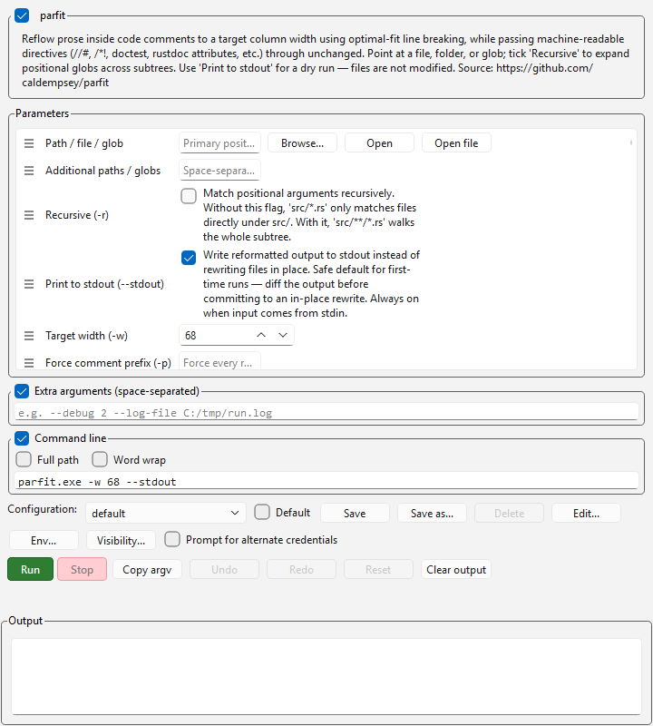

Reflows prose inside code comments to a target column width using Knuth-Plass-style optimal-fit line breaking, while passing machine-readable directives (rustdoc attributes, doctest fences, `//#` markers, shebangs) through unchanged. Point at a file, folder, or glob; tick **Recursive** to expand globs across subtrees; use **Print to stdout** for a dry-run before any in-place rewrite.

Single-form demo. The repeatable `--include` / `--exclude` / `--skip` flags are exposed as raw-text fields per the demo-wide repeatable convention. Drop `parfit.exe` next to the `.scriptree`.

### jit

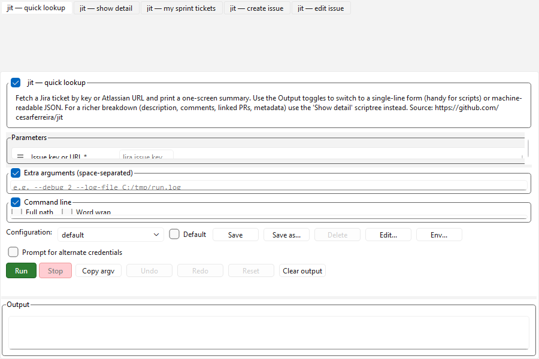

Multi-form demo for the Jira CLI. Five scriptrees grouped under [`jit.scriptreetree`](jit/jit.scriptreetree):

- **Lookup** folder — `lookup` (one ticket by key/URL), `show` (detailed view with comments / linked PRs), `my-tickets` (current sprint).
- **Modify** folder — `create` (new issue), `edit` (modify existing).

Demonstrates how to wrap a multi-subcommand tool with `.scriptreetree`. Each subcommand is its own form so flag sets stay focused. Drop `jit.exe` next to the scriptrees.

### agg

Renders an asciinema `.cast` recording into an animated GIF. Single-form demo with sections for input/output, appearance (theme dropdown, font, line height), timing (speed, FPS cap, idle-time-limit), geometry (cols/rows override, renderer), and logging.

The `--theme` dropdown lists the built-in themes (asciinema, dracula, monokai, nord, solarized, etc.) plus **three custom-palette preset bundles** — single dropdown choices that carry a full 10-colour comma-string. This is the canonical "preset bundle" pattern from the schema docs: one choice = one fully-specified theme, no free-form typing required. `--font-dir` is repeatable upstream; the form exposes one entry.

### hyperfine

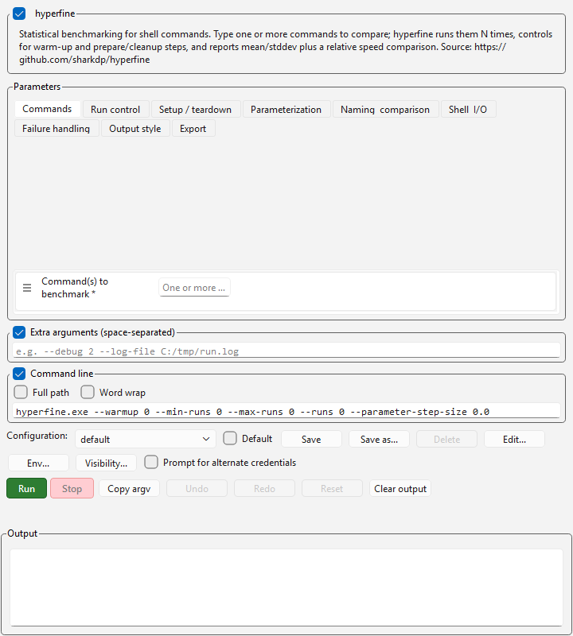

Statistical benchmarking for shell commands. Roughly 25 fields across nine sections — Commands, Run control, Setup/teardown, Parameterization, Naming & comparison, Shell & I/O, Failure handling, Output style, Export. `-u/--time-unit` is a **radio group** (auto / microsecond / millisecond / second) — four mutually-exclusive choices is the sweet spot where radio reads better than a dropdown.

The five export-format flags (markdown / JSON / CSV / AsciiDoc / org-mode) all get file pickers. `--prepare`, `--conclude`, `-L/--parameter-list`, `-n/--command-name`, and `--output` are all repeatable upstream; each has a paired raw-text field for additional entries. Drop `hyperfine.exe` next to the scriptree.

### fd

User-friendly `find` replacement. Single-form demo, ~26 fields across Target, Filters, Traversal, Output, Exec. The `-t/--type` enum lists every entry type fd recognises (file, directory, link, executable, empty, socket, pipe, char/block device). `-c/--color` is a **radio group** (small mutually-exclusive enum is more readable as radio than dropdown); `--hyperlink` stays as an auto/always/never dropdown. `--extension`, `--exclude`, `--exec`, `--exec-batch` are repeatable; raw-text "extra entries" fields cover those.

### dust

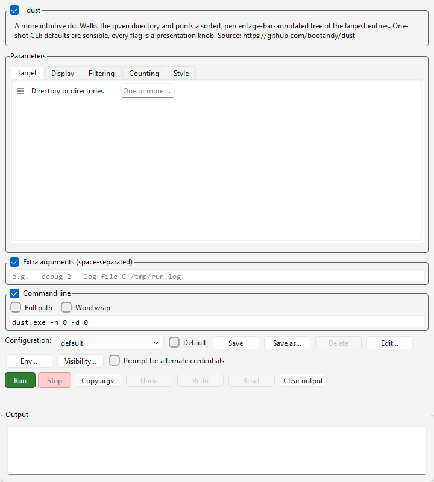

More intuitive `du`. Single-form demo, ~25 fields across Target, Display, Filtering, Counting, Style. The `-o/--output-format` enum forces a specific size unit (si, kb, kib, mb, mib, gb, gib) or auto-picks if blank. `-X/--ignore-directory` is repeatable; the form has a raw-text field for entries.

### bat

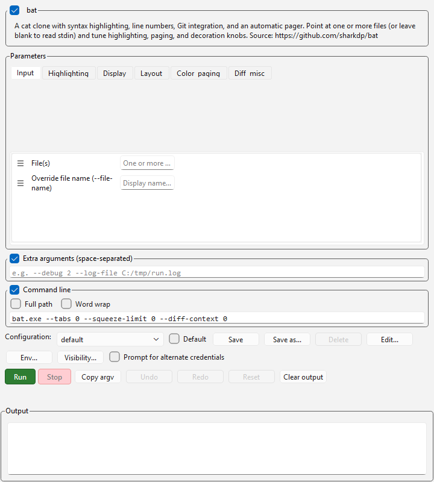

`cat` clone with syntax highlighting. ~33 fields across Input, Highlighting, Display, Layout, Color & paging, Diff & misc. `--style` is a **`checkbox_list` multiselect** with `select_all` (full / auto / plain / changes / header / header-filename / header-filesize / grid / rule / numbers / snip) — bat receives one comma-joined `--style=` token via the conditional inline placeholder form. Most other appearance knobs are enum dropdowns: `--italic-text` (always/never), `--nonprintable-notation` (unicode/caret), `--binary` (no-printing/as-text), `--wrap` (auto/never/character/word), `--color` (auto/always/never), `--decorations` (auto/always/never), `--strip-ansi`, `--paging`. `-m/--map-syntax` is repeatable.

### eza

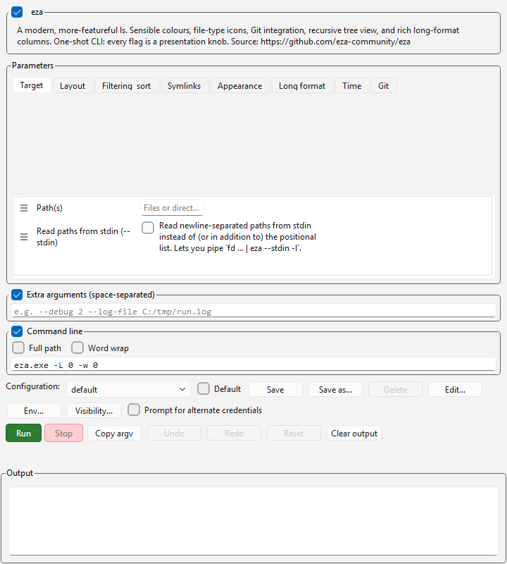

Modern, more-featureful `ls`. The biggest form in the repo — ~55 fields across Target, Layout, Filtering & sort, Symlinks, Appearance, Long format, Time, Git. `--icons` is a **radio group** (auto / always / never — the three-state pattern shared with `fd --color`). Most long-format columns (header, binary/bytes sizes, group, smart-group, links, inode, numeric uid/gid, octal permissions, flags, blocksize, mounts, extended attrs, security context, total-size) only render with `--long` ticked.

### dog

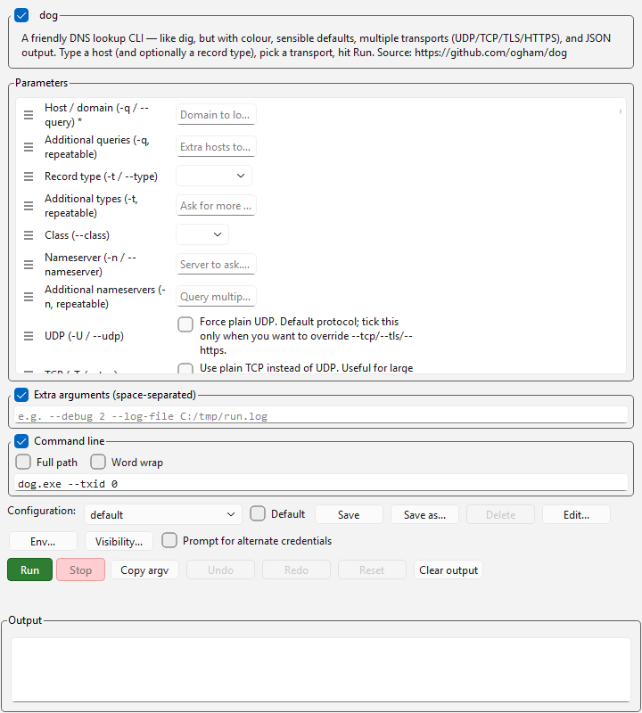

Friendly DNS lookup. ~19 fields across Query, Transport, Protocol tweaks, Output. The `-t/--type` dropdown covers every record type dog supports (A, AAAA, CAA, CNAME, HINFO, LOC, MX, NAPTR, NS, OPT, PTR, SOA, SRV, SSHFP, TLSA, TXT). The four transport flags (`-U` UDP, `-T` TCP, `-S` TLS, `-H` HTTPS) are exposed as separate booleans — pick one. `-q`, `-t`, `-n`, `-Z` are all repeatable.

### cvforge

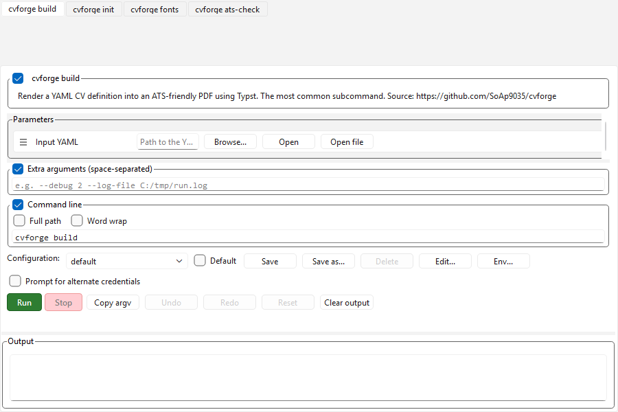

YAML → ATS-friendly PDF resume via Typst. Four scriptrees grouped under [`cvforge.scriptreetree`](cvforge/cvforge.scriptreetree):

- **Render** folder — `build` (YAML → PDF), `init` (scaffold a starter `cv.yaml`).
- **Inspect** folder — `fonts` (list available fonts), `ats-check` (verify a PDF parses through ATS).

Each subcommand's form is tiny — most have one or zero arguments — but the four-button launcher is the value: one click each, no remembering subcommand names. Expects `cvforge` on `PATH` (`pip install cvforge` or `uv tool install cvforge`).

### bifrost

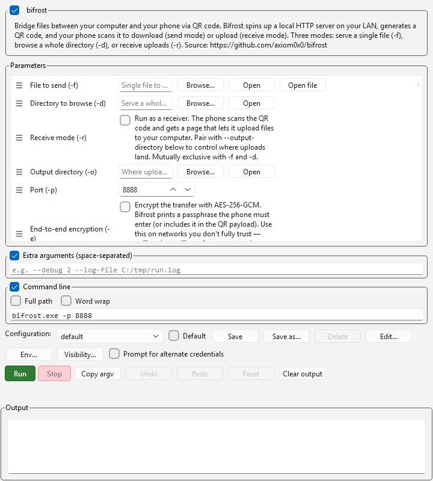

Bridges files between computer and phone via QR code. Single Go binary spins up a local HTTP server on the LAN, prints a QR, and the phone scans it to download (`-f` send file, `-d` browse directory) or upload (`-r` receive). Optional AES-256-GCM end-to-end encryption with `-e`.

The three modes (`-f`, `-d`, `-r`) are mutually exclusive but exposed as three independent fields — ScripTree's `argument_template` only supports boolean-conditional emission, so we can't drive three different argv outputs from one radio control. The section headers ("Send (one of three modes)" / "Receive (one of three modes)") nudge you to pick exactly one.

### gh

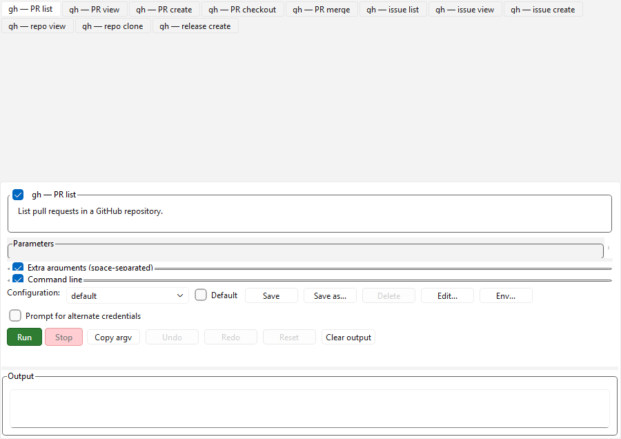

GitHub CLI. Eleven scriptrees grouped under [`gh.scriptreetree`](gh/gh.scriptreetree):

- **Pull requests** folder — `pr list`, `pr view`, `pr create`, `pr checkout`, `pr merge`.
- **Issues** folder — `issue list`, `issue view`, `issue create`.
- **Repository** folder — `repo view`, `repo clone`.
- **Releases** folder — `release create`.

Most `gh` commands have `-R/--repo` plus 5–15 flags; the form factor names every flag, lays out the enum choices for `--state`, and gives file pickers for `--body-file` / `--notes-file`. The `pr merge` form models merge / squash / rebase as three booleans in a "Strategy (one of three)" section — same pattern as bifrost's mode selector. Repeatable flags (`-l/--label`, `-a/--assignee`, `-r/--reviewer`) use the paired typed-widget + raw-text "extra entries" pattern.

Intentionally omitted: `gh auth login` (interactive flow), `gh release upload` (no repeatable-file widget), `gh api` (raw HTTP — typing it is faster), and the `workflow` / `run` group (a separate demo on its own). Expects `gh` on `PATH`.

### awk

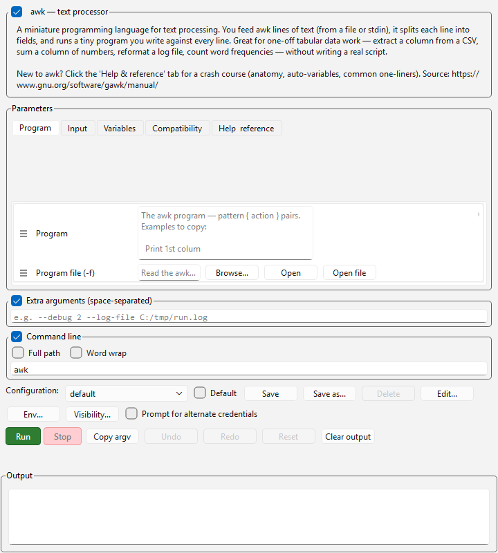

Classic UNIX text-processing language. Single-form demo with ~8 fields covering the program (textarea), program file (`-f`), input files, field separator (`-F`), one `-v` variable, and gawk's `--posix` / `--traditional` / `-b` compatibility flags.

The form leans hardest on noobie-friendly help: the top-level description explains the pattern-action model, the auto-variables (`$1`, `$NF`, `NR`, `NF`, `FS`, `OFS`), and lists ten essential one-liners. The README adds a glossary, a "what to know first" ladder, and worked examples. Expects `awk` on `PATH` (gawk recommended for the compatibility flags to do anything).

### sed

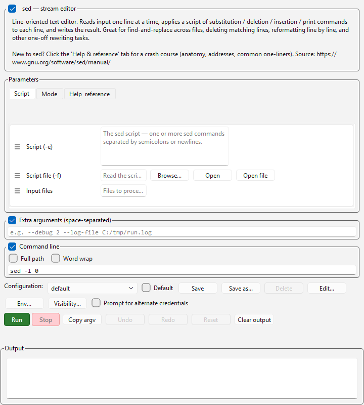

Stream editor for line-oriented text transforms. Single-form demo with ~9 fields: script (textarea), script file (`-f`), input files, plus mode flags (`-n` quiet, `-E` extended regex, `-i` in-place, `-s` separate streams, `-z` NUL-separated, `-l` line-wrap length).

The `-i` flag emits bare (works on GNU sed); BSD sed users on macOS should `brew install gnu-sed` and switch the form's executable to `gsed` for cross-platform consistency. The README has a glossary (script / command / address / pattern space / hold space) and worked examples.
