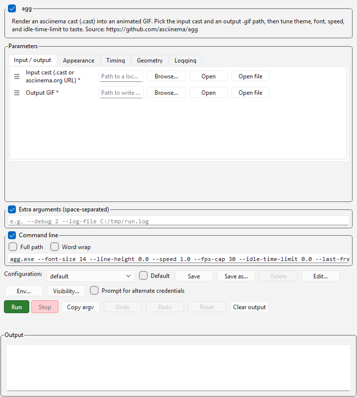

# agg — ScripTree demo

A ScripTree GUI for **[agg](https://github.com/asciinema/agg)** by [asciinema](https://github.com/asciinema).

## What agg does

agg renders an [asciinema](https://asciinema.org/) terminal-session recording (`.cast` file) into an animated GIF. One-shot CLI — point it at a cast file, give it an output path, and it writes the GIF.

## What's in this demo

| File | Purpose |
|------|---------|
| [`agg.scriptree`](agg.scriptree) | Single-form GUI for agg. Two required positional fields (input cast, output GIF) plus four sections of optional controls: Appearance, Timing, Geometry, Logging. Dropdowns for theme and renderer; numeric fields for font-size, speed, fps-cap, idle-time-limit, etc. |

The `.scriptree` expects `agg.exe` to live in the same folder. Drop it (or a symlink) next to the file, or edit the `executable` field to point wherever you've installed it.

## Repeatable flag caveat

`--font-dir` is repeatable upstream. This demo exposes a single folder picker for the simple case; if you need multiple font directories you can either:

- Add a sibling string param and write the full repeated flag (`--font-dir D:/fonts1 --font-dir D:/fonts2`) — ScripTree's argv emitter shlex-tokenizes string-typed fields whose placeholder fills the whole template token (v0.1.3+, see `help/LLM/argument_template.md`).
- Or call `agg` directly when you need more than the form covers.

## Screenshots

### Form view



### As it appears in the workspace forest

The cell on the right is this demo, docked to the workspace forest hub:


## Installing agg

See the [upstream README](https://github.com/asciinema/agg#installation) for current install instructions. Common paths:

```bash
cargo install --git https://github.com/asciinema/agg
# or via the prebuilt Docker image:
docker run --rm -v $PWD:/data ghcr.io/asciinema/agg demo.cast demo.gif
```

## Upstream

- Repository: <https://github.com/asciinema/agg>
- Author: [asciinema project](https://github.com/asciinema)
- License: see upstream repo

This demo is independent of the agg project; it just generates a GUI front-end for the CLI. Bug reports about agg's behaviour belong upstream; bug reports about the form layout belong here.
