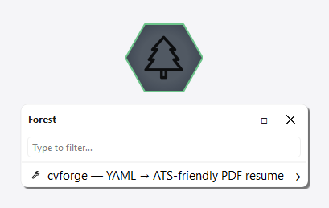
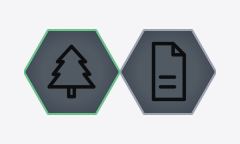
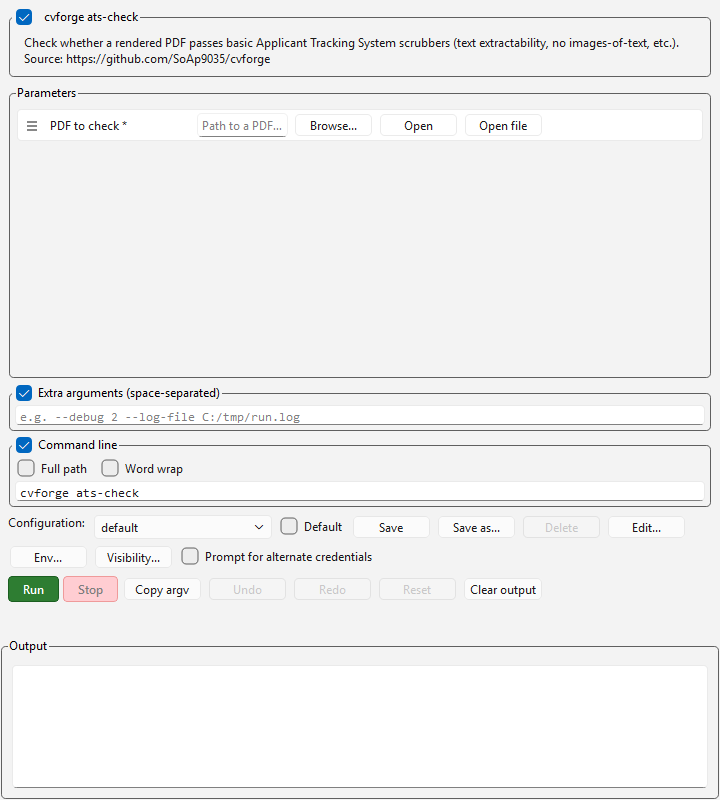
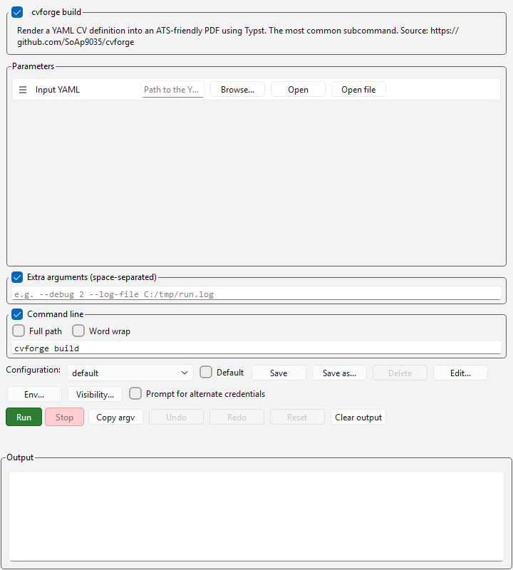
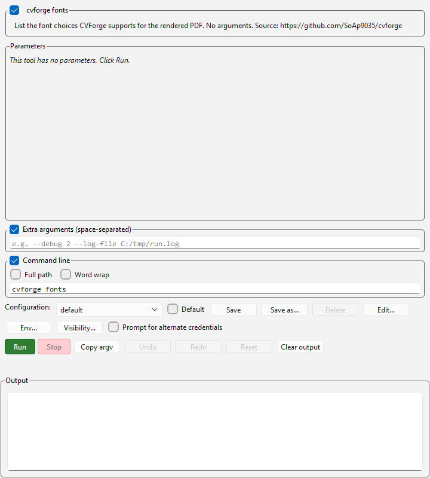
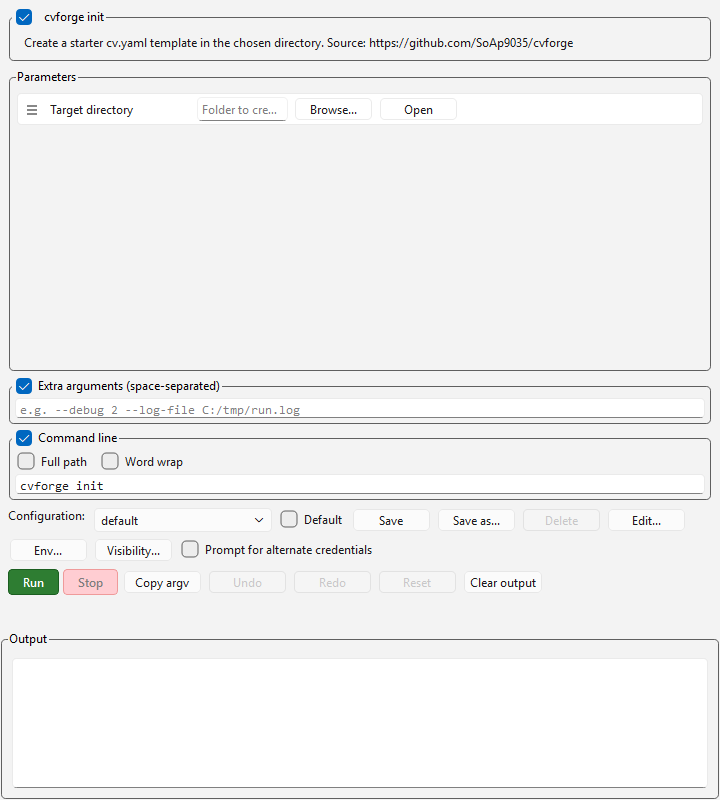

# cvforge — ScripTree demo

A ScripTree GUI for **[cvforge](https://github.com/SoAp9035/cvforge)** by [Ahmet Burhan Kayalı](https://github.com/SoAp9035).

## What cvforge does

cvforge turns a YAML CV definition into a clean, ATS-friendly PDF using [Typst](https://typst.app/). One command renders; another scaffolds a starter YAML; another lists the fonts you can pick from inside the YAML; another inspects an existing PDF for ATS-parseability.

## What's in this demo

Four scriptrees grouped by workflow under [`cvforge.scriptreetree`](cvforge.scriptreetree):

### Render folder

| File | Purpose |
|------|---------|
| [`build.scriptree`](build.scriptree) | `cvforge build [input]` — render the YAML CV to PDF. Optional file picker; defaults to `cv.yaml` in the current directory if blank. |
| [`init.scriptree`](init.scriptree) | `cvforge init [directory]` — create a starter `cv.yaml` template populated with every available field. Optional folder picker; defaults to the current directory. |

### Inspect folder

| File | Purpose |
|------|---------|
| [`fonts.scriptree`](fonts.scriptree) | `cvforge fonts` — list every font name CVForge can use. No arguments. |
| [`ats-check.scriptree`](ats-check.scriptree) | `cvforge ats-check <pdf>` — verify a PDF parses correctly through typical Applicant Tracking Systems. Required file picker. |

The scriptrees expect `cvforge` to be on `PATH` (i.e. installed via `pip install cvforge` or `uv tool install cvforge`). If it's not, edit each `executable` field to point at the binary.

## Why a GUI for a CLI tool?

`cvforge build` and `cvforge init` are honestly faster typed than form-filled. The GUI's value is the four-button launcher — `init` to scaffold, `build` to render, `ats-check` to validate, `fonts` to browse. One click each, no remembering the subcommand names.

## Screenshots

### Tabbed standalone view

Every tool on its own tab — what you get when you single-click the tree's cell:


### Forest menu

Double-click the cell in the workspace forest to get the merged tree as a popup menu:



### Workspace cell

Docked to the forest hub:



### Per-tool forms

#### ats-check — verify PDF ATS-parseability



#### build — render YAML → PDF



#### fonts — list available fonts



#### init — scaffold a starter cv.yaml



## Installing cvforge

See the [upstream README](https://github.com/SoAp9035/cvforge#readme). Common paths:

```bash
pip install cvforge
# or
uv tool install cvforge
```

Requires Python 3.10+.

## Upstream

- Repository: <https://github.com/SoAp9035/cvforge>
- Author: [@SoAp9035](https://github.com/SoAp9035) (Ahmet Burhan Kayalı)
- License: see upstream repo

This demo is independent of the cvforge project; it just generates a GUI front-end for the CLI. Bug reports about cvforge's behaviour belong upstream; bug reports about the form layout belong here.
