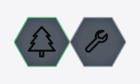

# dog — ScripTree demo

A ScripTree GUI for **[dog](https://github.com/ogham/dog)** by [Benjamin Sago](https://github.com/ogham).

## What dog does

dog is a friendly DNS lookup CLI. Like `dig`, but with colour, sensible defaults, multiple transports (UDP, TCP, DNS-over-TLS, DNS-over-HTTPS), and JSON output. One-shot CLI — every invocation is one or more queries against one or more nameservers.

## What's in this demo

| File | Purpose |
|------|---------|
| [`dog.scriptree`](dog.scriptree) | Single-form GUI. ~19 fields across Query, Transport, Protocol tweaks, and Output sections. Record-type and class dropdowns; checkbox row for the four transports. |

The `.scriptree` expects `dog.exe` to live in the same folder. Drop it (or a symlink) next to the file, or edit the `executable` field.

## Repeatable flags

`-q`, `-t`, `-n`, and `-Z` are all repeatable upstream. The first instance of each is a dedicated field; additional entries go in a paired text field where you write the full repeated flag and ScripTree splits it into multiple argv tokens at run time:

```
-q example.com -q apple.com -t MX -t TXT -n 1.1.1.1 -n 8.8.8.8
```

(See `help/LLM/argument_template.md`'s string-passthrough auto-split rule. v0.1.3+.)

## Why a GUI for a CLI tool?

`dog example.com` is faster typed than form-filled. The GUI earns its keep when comparing resolvers — `-n 1.1.1.1 -n 8.8.8.8 -n 9.9.9.9 --tls --time -t MX example.com` is a lot of flags to remember and easy to fumble with the wrong shorthand. Type/class dropdowns and a checkbox row for the four transports make the form much faster than scanning the man page.

## Screenshots

### Form view


### As it appears in the workspace forest

The cell on the right is this demo, docked to the workspace forest hub:



## Installing dog

See the [upstream README](https://github.com/ogham/dog#installation). Common paths:

```bash
cargo install dog
# or via package manager:
brew install dog
```

## Upstream

- Repository: <https://github.com/ogham/dog>
- Author: [@ogham](https://github.com/ogham)
- License: see upstream repo

This demo is independent of the dog project; it just generates a GUI front-end for the CLI. Bug reports about dog's behaviour belong upstream; bug reports about the form layout belong here.
