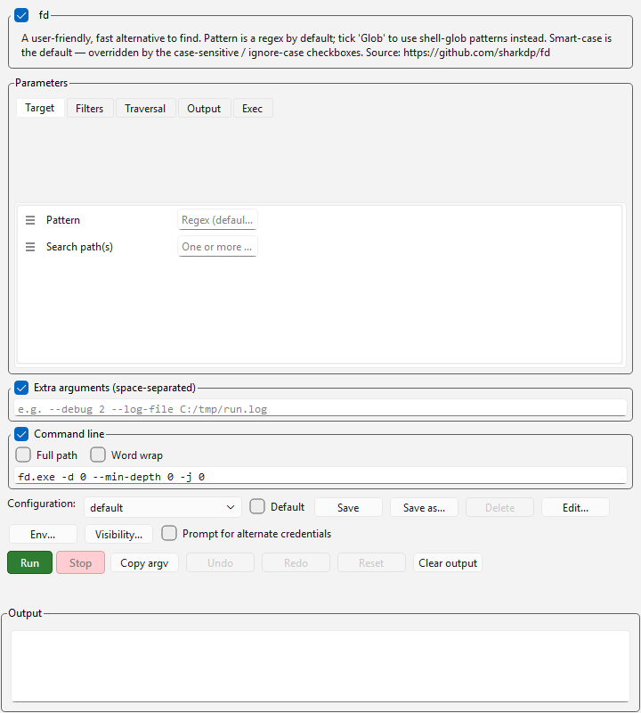

# fd — ScripTree demo

A ScripTree GUI for **[fd](https://github.com/sharkdp/fd)** by [David Peter (sharkdp)](https://github.com/sharkdp).

## What fd does

fd is a fast, user-friendly alternative to `find`. Pattern is regex by default (or glob with `--glob`); smart-case is on unless you force `-s`/`-i`; .gitignore/.fdignore is respected unless you pass `-I`. One-shot CLI — every search is a single command.

## What's in this demo

| File | Purpose |
|------|---------|
| [`fd.scriptree`](fd.scriptree) | Single-form GUI. ~26 fields across Target, Filters, Traversal, Output, and Exec sections. |

The `.scriptree` expects `fd.exe` to live in the same folder. Drop it (or a symlink) next to the file, or edit the `executable` field.

## Repeatable flags

Several fd flags are repeatable (`-e`/`--extension`, `-E`/`--exclude`, `-x`/`--exec`, `-X`/`--exec-batch`). The first instance is a dedicated field and additional entries go in a paired text field where you write the full repeated flag — ScripTree splits it into multiple argv tokens at run time:

```
--exclude '*.lock' --exclude 'node_modules' --exclude 'target/**'
```

(See `help/LLM/argument_template.md`'s string-passthrough auto-split rule. v0.1.3+.)

## Why a GUI for a CLI tool?

Plain `fd foo` is faster typed than form-filled. But once you start stacking filters — `--type f --extension md --extension rst --exclude target --changed-within 7d --size +1k` — the form pays off: dropdowns for type and color, named slots for size and time filters, and a checkbox row that makes the smart-case override unambiguous.

## Screenshots

### Form view



### As it appears in the workspace forest

The cell on the right is this demo, docked to the workspace forest hub:


## Installing fd

See the [upstream README](https://github.com/sharkdp/fd#installation). Common paths:

```bash
cargo install fd-find
# or via package manager:
brew install fd
winget install sharkdp.fd
```

## Upstream

- Repository: <https://github.com/sharkdp/fd>
- Author: [@sharkdp](https://github.com/sharkdp)
- License: see upstream repo

This demo is independent of the fd project; it just generates a GUI front-end for the CLI. Bug reports about fd's behaviour belong upstream; bug reports about the form layout belong here.
