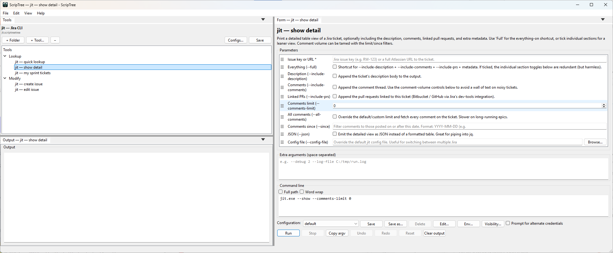
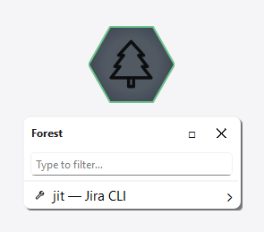
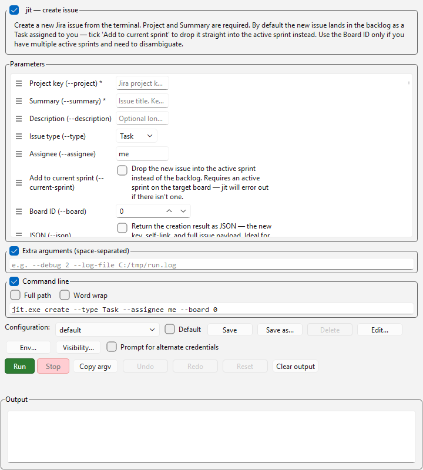
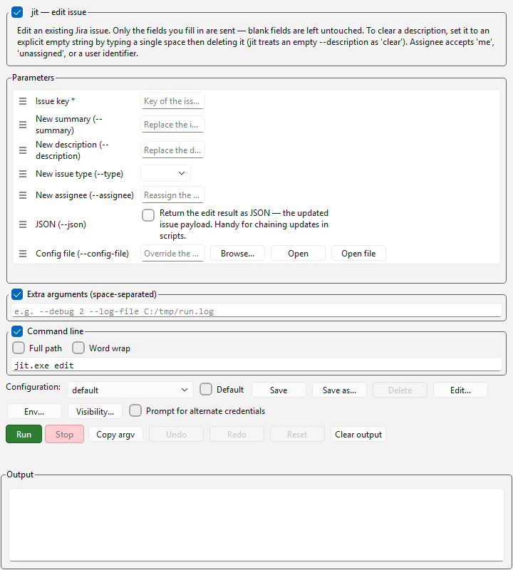
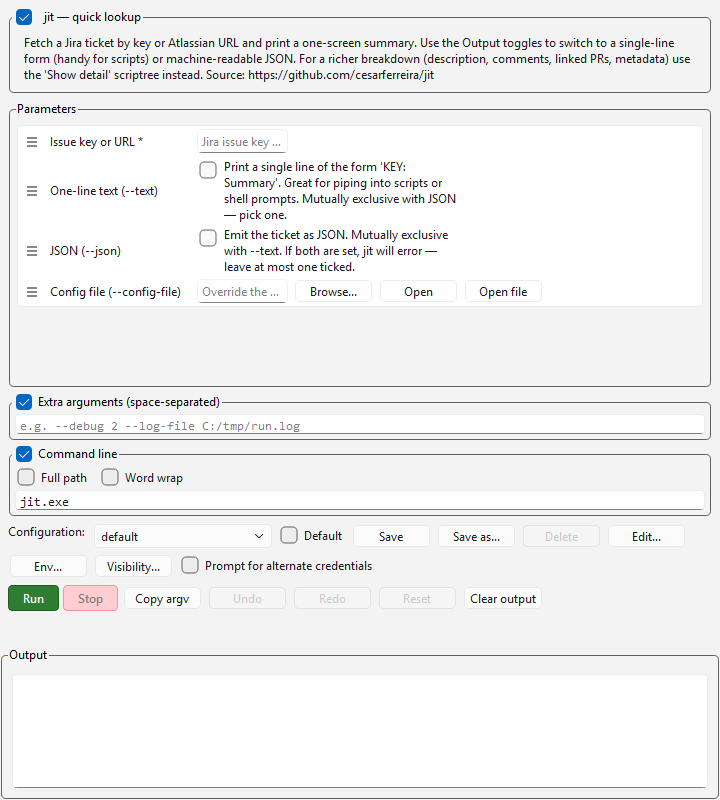
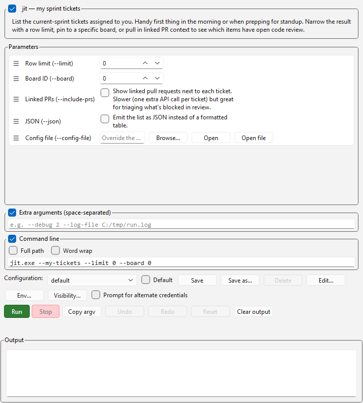
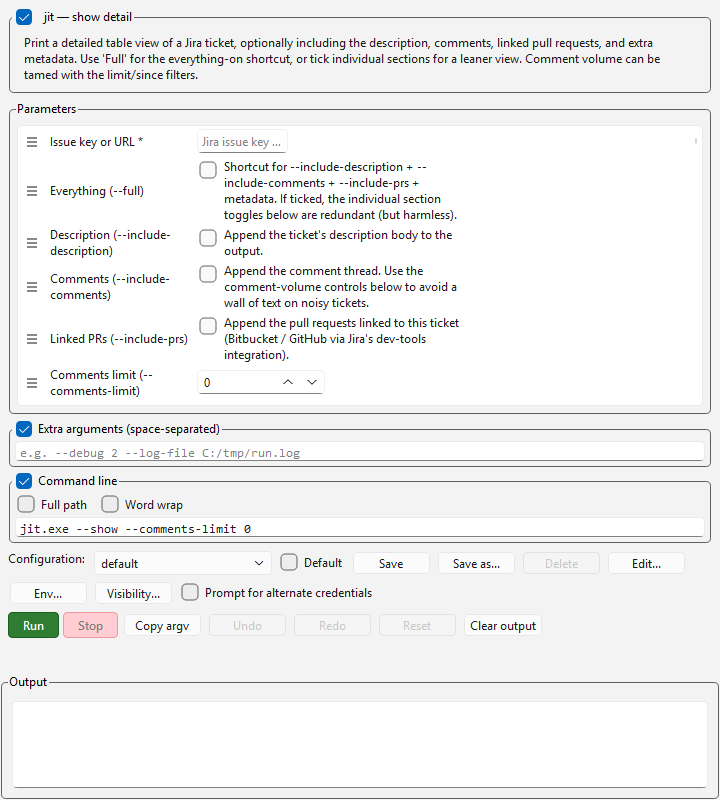

# jit — ScripTree demo

A ScripTree GUI for **[jit](https://github.com/cesarferreira/jit)** by [César Ferreira](https://github.com/cesarferreira).

## What jit does

jit is a Jira CLI for ticket lookup, detailed issue inspection, sprint views, and creating or editing issues from the terminal. It's fully scriptable — every operation is a one-shot command with flags, no interactive prompts.

## What's in this demo

Five scriptrees, grouped by workflow under [`jit.scriptreetree`](jit.scriptreetree):

### Lookup folder

| File | Purpose |
|------|---------|
| [`lookup.scriptree`](lookup.scriptree) | Bare `jit KEY` lookup. Required: issue key or Atlassian URL. Optional: `--text` (one-line) / `--json` toggles. |
| [`show.scriptree`](show.scriptree) | `jit --show KEY` with detail toggles: `--full`, `--include-description`, `--include-comments`, `--include-prs`, plus comment-volume controls (`--comments-limit`, `--all-comments`, `--since`). |
| [`my-tickets.scriptree`](my-tickets.scriptree) | `jit --my-tickets` sprint list with `--limit`, `--board`, `--include-prs`. |

### Modify folder

| File | Purpose |
|------|---------|
| [`create.scriptree`](create.scriptree) | `jit create` form. Required Project + Summary; Type dropdown (Task/Story/Bug); Assignee, current-sprint toggle, board disambiguator. |
| [`edit.scriptree`](edit.scriptree) | `jit edit KEY` form. Blank fields are left untouched; an explicit empty `--description` clears the field. |

Every form carries a `--config-file` field in a "Config" section so you can swap Jira instances per-invocation.

The scriptrees expect `jit.exe` to live in the same folder. Drop it (or a symlink) next to the files, or edit each `executable` field.

## Why a GUI for a CLI tool?

The lookup forms (especially bare `jit KEY`) are honestly faster at the terminal than as a GUI form — but `create` and `edit` benefit a lot from a typed form: dropdowns for issue type, named fields for assignee/project, no need to remember flag names. The lookup scriptrees are included for completeness and discoverability rather than speed.

## Screenshots

### Tabbed standalone view

Every tool on its own tab — what you get when you single-click the tree's cell:

### Forest menu

Double-click the cell in the workspace forest to get the merged tree as a popup menu:

### Workspace cell

Docked to the forest hub:

### Per-tool forms

#### create — new issue

#### edit — modify existing

#### lookup — single ticket by key/URL

#### my-tickets — current sprint

#### show — detailed issue view

## Installing jit

See the [upstream README](https://github.com/cesarferreira/jit#installation) for current install instructions.

## Upstream

- Repository: <https://github.com/cesarferreira/jit>
- Author: [@cesarferreira](https://github.com/cesarferreira)
- License: see upstream repo

This demo is independent of the jit project; it just generates a GUI front-end for the CLI. Bug reports about jit's behaviour belong upstream; bug reports about the form layout belong here.
