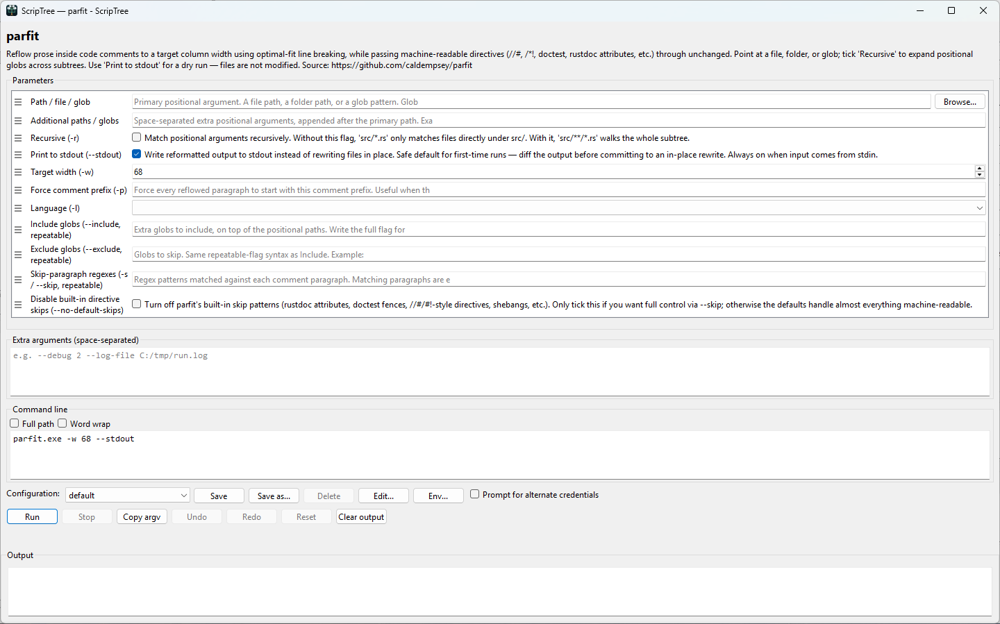

# parfit — ScripTree demo

A ScripTree GUI for **[parfit](https://github.com/caldempsey/parfit)** by [Cal Dempsey](https://github.com/caldempsey).



## What parfit does

parfit reflows the prose inside source-code comments to a target column width using optimal-fit (Knuth-Plass-style) line breaking, while passing machine-readable directives — rustdoc attributes, doctest fences, `//#` / `#!`-style markers, shebangs, etc. — through unchanged.

It recognises comment syntax for: rust, python, shell, elixir, go, javascript, java, scala, c, lua, sql, lisp (plus a `text` mode for plain-text reflow).

## What's in this demo

| File | Purpose |
|------|---------|
| [`parfit.scriptree`](parfit.scriptree) | Single-form GUI for parfit. 11 params across 5 sections (Target, Formatting, Language, Filtering, Config). Defaults to `--stdout` so first-time runs are non-destructive. |
| [`parfit.scriptreetree`](parfit.scriptreetree) | Tree wrapper that surfaces `parfit.scriptree` under a "Reflow comments" folder — useful when you want the standalone, single-tool launcher view. |

The `.scriptree` expects `parfit.exe` to live in the same folder. Drop it (or a symlink) next to the file, or edit the `executable` field to point wherever you've installed it.

## Repeatable flags caveat

ScripTree's current schema has no first-class repeatable-flag widget, so `--include`, `--exclude`, and `--skip` are exposed as raw text fields where you write the full flag for each entry, e.g.:

```
--include src/**/*.rs --include build.rs
```

If/when ScripTree grows a list widget, those three fields are the candidates to upgrade.

## Installing parfit

From the upstream README:

```bash
cargo install parfit
# or
brew install caldempsey/parfit/parfit
```

## Upstream

- Repository: <https://github.com/caldempsey/parfit>
- Author: [@caldempsey](https://github.com/caldempsey)
- License: see upstream repo

This demo is independent of the parfit project; it just generates a GUI front-end for the CLI. Bug reports about parfit's behaviour belong upstream; bug reports about the form layout belong here.
